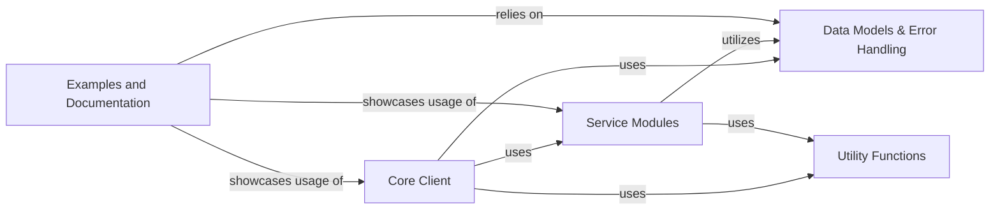

## Details

This analysis outlines the final component structure of the `friendli_core` SDK, detailing its five key components: Core Client, Service Modules, Data Models & Error Handling, Utility Functions, and Examples and Documentation. It describes each component's role, associated source files, and interactions within the SDK, providing a comprehensive overview of the system's architecture and interdependencies.

### Core Client
The central entry point for the SDK, responsible for managing authentication, session handling, and dispatching requests to the appropriate service modules. It provides the primary interface for users to interact with the Friendli AI platform.

**Related Classes/Methods**:

- `friendli_core.client` (1:1)

### Service Modules [[Expand]](./Service_Modules.md)
Encapsulate specific API functionalities (e.g., chat, completions, image generation, audio processing). Each module provides high-level methods for its domain, abstracting the underlying RESTful API calls and handling domain-specific logic.

**Related Classes/Methods**:

- `friendli_core.chat`
- `friendli_core.completions`
- `friendli_core.image`
- `friendli_core.audio`

### Data Models & Error Handling [[Expand]](./Data_Models_Error_Handling.md)
Defines standardized data structures for all API requests and responses, ensuring consistent data representation across the SDK. This component also provides a comprehensive set of error types, facilitating robust and standardized error reporting from the Friendli AI platform.

**Related Classes/Methods**:

- `friendli_core.models` (1:1)
- `friendli_core.errors` (1:1)

### Utility Functions
Provides common helper functions for SDK-wide tasks such as JSON serialization/deserialization, parameter validation, configuration loading, and other reusable logic that supports the core functionalities.

**Related Classes/Methods**:

- `friendli_core.utils` (1:1)

### Examples and Documentation
Comprises practical code examples demonstrating how to effectively use the SDK's functionalities and comprehensive documentation (API references, guides) to assist developers in integrating and utilizing the Friendli AI platform.

**Related Classes/Methods**:

- `examples` (1:1)
- `docs` (1:1)

### [FAQ](https://github.com/CodeBoarding/GeneratedOnBoardings/tree/main?tab=readme-ov-file#faq)
