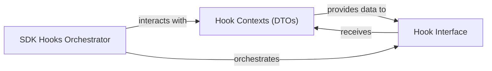

## Details

Offers an extensible mechanism for injecting custom logic at various stages of the request/response lifecycle, allowing for pre-processing, post-processing, and error handling customization.

### Hook Contexts (DTOs)
A set of specialized Data Transfer Objects (DTOs) that encapsulate and pass relevant data and state through different stages of the API request/response lifecycle. These contexts provide the necessary information for hooks to operate on.

**Related Classes/Methods**:

- `friendli_core._hooks.types.HookContext`:11-30
- `friendli_core._hooks.types.BeforeRequestContext`:33-41
- `friendli_core._hooks.types.AfterSuccessContext`:44-52
- `friendli_core._hooks.types.AfterErrorContext`:55-63

### Hook Interface
Defines the abstract interface or base class that custom hooks must implement. It establishes the contract for various hook methods (e.g., `before_request`, `after_success`, `after_error`), ensuring a consistent extensibility point for SDK users.

**Related Classes/Methods**:

- `friendli_core._hooks.types.Hooks`:99-114

### SDK Hooks Orchestrator
The central manager responsible for registering, storing, and orchestrating the execution of various custom hooks at the appropriate stages of the SDK's request/response lifecycle. It acts as a facade for the entire hooks mechanism.

**Related Classes/Methods**:

- `friendli_core._hooks.sdkhooks.SDKHooks`:21-78

### [FAQ](https://github.com/CodeBoarding/GeneratedOnBoardings/tree/main?tab=readme-ov-file#faq)
