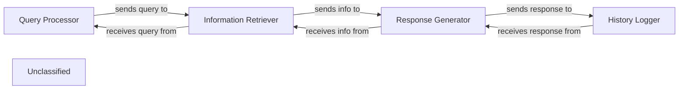

## Details

This graph represents the core functionality of a system that processes user queries, generates responses using a language model, and stores interaction history. The main flow involves receiving a query, retrieving relevant information, generating a response, and then saving the interaction. Its purpose is to provide an interactive question-answering system with memory.

### Query Processor
Handles incoming user queries and prepares them for further processing.

**Related Classes/Methods**:

- `QueryHandler.process`

### Information Retriever
Fetches relevant information based on the processed query from a knowledge base.

**Related Classes/Methods**:

- <a href="https://github.com/CodeBoarding/friendli-python/blob/main/.codeboardingsrc/friendli_core/knowledge.py#L20-L115" target="_blank" rel="noopener noreferrer">`KnowledgeBase.retrieve`:20-115</a>

### Response Generator
Utilizes a language model to generate a natural language response.

**Related Classes/Methods**:

- <a href="https://github.com/CodeBoarding/friendli-python/blob/main/.codeboardingsrc/friendli_core/model.py" target="_blank" rel="noopener noreferrer">`LanguageModel.generate_response`</a>

### History Logger
Stores the user query and the generated response for future reference.

**Related Classes/Methods**:

- <a href="https://github.com/CodeBoarding/friendli-python/blob/main/.codeboardingsrc/friendli_core/utils/logger.py" target="_blank" rel="noopener noreferrer">`InteractionLogger.log`</a>

### Unclassified
Component for all unclassified files and utility functions (Utility functions/External Libraries/Dependencies)

**Related Classes/Methods**: _None_

### [FAQ](https://github.com/CodeBoarding/GeneratedOnBoardings/tree/main?tab=readme-ov-file#faq)
