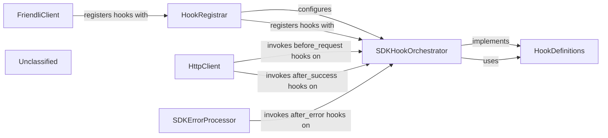

## Details

The `friendli_core._hooks` subsystem provides a robust extension mechanism for the Friendli SDK. The `FriendliClient` initiates this by providing custom logic to the `HookRegistrar`, which then configures the `SDKHookOrchestrator`. This orchestrator is central to the subsystem, managing and invoking various hook types—defined by `HookDefinitions`—at critical junctures. For instance, the `HttpClient` triggers hooks before sending requests and after receiving responses, while the `SDKErrorProcessor` activates specific hooks when exceptions occur. This design allows for flexible customization of SDK behavior without altering its core implementation, enhancing adaptability and maintainability.

### FriendliClient
The primary interface for users to interact with the SDK and register custom extensions. Initializes the SDK and provides custom hook implementations to the `HookRegistrar`.

**Related Classes/Methods**:

- <a href="https://github.com/CodeBoarding/friendli-python/blob/main/.codeboardingsrc/friendli_core/sdk.py" target="_blank" rel="noopener noreferrer">`friendli_core.FriendliClient`</a>

### HookRegistrar
The component responsible for receiving and organizing custom hook implementations. Receives custom hook instances from `FriendliClient` and adds them to the `SDKHookOrchestrator` for later invocation.

**Related Classes/Methods**:

- <a href="https://github.com/CodeBoarding/friendli-python/blob/main/.codeboardingsrc/friendli_core/_hooks/registration.py#L8-L12" target="_blank" rel="noopener noreferrer">`friendli_core._hooks.registration.init_hooks`:8-12</a>

### SDKHookOrchestrator
The central component that manages the lifecycle of hooks, invoking them at appropriate stages of SDK operations. Stores and manages different types of hooks. It is responsible for invoking the correct hooks (e.g., `before_request`, `after_success`, `after_error`) when triggered by `HttpClient` or `SDKErrorProcessor`, ensuring they adhere to `HookDefinitions`.

**Related Classes/Methods**:

- <a href="https://github.com/CodeBoarding/friendli-python/blob/main/.codeboardingsrc/friendli_core/_hooks/sdkhooks.py#L22-L79" target="_blank" rel="noopener noreferrer">`friendli_core._hooks.sdkhooks.SDKHooks`:22-79</a>

### HookDefinitions
The collection of abstract interfaces and data structures that define the contract and context for all types of hooks. Defines the abstract base classes for various hook types (e.g., `SDKInitHook`, `BeforeRequestHook`) and their associated context objects, establishing the API for custom extensions.

**Related Classes/Methods**:

- <a href="https://github.com/CodeBoarding/friendli-python/blob/main/.codeboardingsrc/friendli_core/_hooks/types.py#L100-L115" target="_blank" rel="noopener noreferrer">`friendli_core._hooks.types.Hooks`:100-115</a>
- <a href="https://github.com/CodeBoarding/friendli-python/blob/main/.codeboardingsrc/friendli_core/_hooks/types.py#L67-L70" target="_blank" rel="noopener noreferrer">`friendli_core._hooks.types.SDKInitHook`:67-70</a>
- <a href="https://github.com/CodeBoarding/friendli-python/blob/main/.codeboardingsrc/friendli_core/_hooks/types.py#L73-L78" target="_blank" rel="noopener noreferrer">`friendli_core._hooks.types.BeforeRequestHook`:73-78</a>
- <a href="https://github.com/CodeBoarding/friendli-python/blob/main/.codeboardingsrc/friendli_core/_hooks/types.py#L81-L86" target="_blank" rel="noopener noreferrer">`friendli_core._hooks.types.AfterSuccessHook`:81-86</a>
- <a href="https://github.com/CodeBoarding/friendli-python/blob/main/.codeboardingsrc/friendli_core/_hooks/types.py#L89-L97" target="_blank" rel="noopener noreferrer">`friendli_core._hooks.types.AfterErrorHook`:89-97</a>
- <a href="https://github.com/CodeBoarding/friendli-python/blob/main/.codeboardingsrc/friendli_core/_hooks/types.py#L12-L31" target="_blank" rel="noopener noreferrer">`friendli_core._hooks.types.HookContext`:12-31</a>

### HttpClient
The underlying mechanism for making external network requests, which integrates with the hook system. Executes network requests. Before sending a request, it notifies the `SDKHookOrchestrator` to run `before_request` hooks. After receiving a response, it notifies the `SDKHookOrchestrator` to run `after_success` hooks.

**Related Classes/Methods**:

- <a href="https://github.com/CodeBoarding/friendli-python/blob/main/.codeboardingsrc/friendli_core/httpclient.py#L11-L47" target="_blank" rel="noopener noreferrer">`friendli_core.httpclient.HttpClient`:11-47</a>

### SDKErrorProcessor
The part of the SDK responsible for handling exceptions and triggering error-specific hooks. Catches and processes exceptions during SDK operations. Upon an error, it notifies the `SDKHookOrchestrator` to run `after_error` hooks.

**Related Classes/Methods**:

- <a href="https://github.com/CodeBoarding/friendli-python/blob/main/.codeboardingsrc/friendli_core/models/sdkerror.py#L12-L39" target="_blank" rel="noopener noreferrer">`friendli_core.SDKErrorProcessor`:12-39</a>

### Unclassified
Component for all unclassified files and utility functions (Utility functions/External Libraries/Dependencies)

**Related Classes/Methods**: _None_

### [FAQ](https://github.com/CodeBoarding/GeneratedOnBoardings/tree/main?tab=readme-ov-file#faq)
