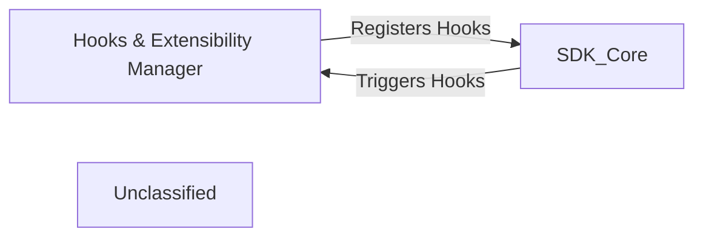

## Details

The `friendli_core` SDK is designed with extensibility in mind, primarily through its `Hooks & Extensibility Manager`. This central component, embodied by classes like `HookRegistrar` and `SDKHooks`, facilitates the dynamic registration and execution of custom logic. The `HookRegistrar` acts as the entry point for defining new hooks, while `SDKHooks` provides the mechanism for the SDK's core functionalities to discover and invoke these registered hooks at predetermined points. This architecture ensures that the SDK remains flexible and adaptable, allowing for easy integration of custom behaviors and extensions without altering the core codebase.

### Hooks & Extensibility Manager
This component is responsible for managing the registration, discovery, and execution of various custom logic hooks throughout the SDK's lifecycle. It provides the core mechanism for extensibility.

**Related Classes/Methods**:

- `friendli_core._hooks.registration.HookRegistrar`
- <a href="https://github.com/CodeBoarding/friendli-python/blob/main/.codeboardingsrc/friendli_core/_hooks/sdkhooks.py#L22-L79" target="_blank" rel="noopener noreferrer">`friendli_core._hooks.sdkhooks.SDKHooks`:22-79</a>

### Unclassified
Component for all unclassified files and utility functions (Utility functions/External Libraries/Dependencies)

**Related Classes/Methods**: _None_

### [FAQ](https://github.com/CodeBoarding/GeneratedOnBoardings/tree/main?tab=readme-ov-file#faq)
