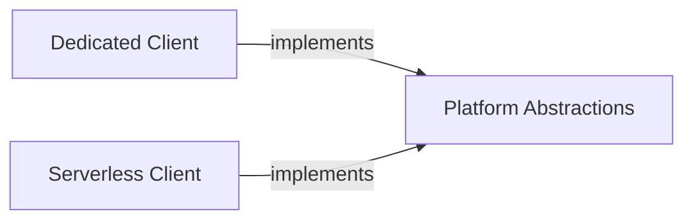

## Details

Abstract Components Overview

### Platform Abstractions [[Expand]](./Platform_Abstractions.md)
Defines the foundational base structures and interfaces that enable the SDK to adapt its behavior to various operational modes (e.g., dedicated, serverless) of the Friendli platform. It provides the abstract contracts for interacting with different deployment types.

**Related Classes/Methods**:

- <a href="https://github.com/friendliai/friendli-python/blob/main/src/friendli_core/basesdk.py#L19-L106" target="_blank" rel="noopener noreferrer">`friendli_core.basesdk:BaseSDK` (19:106)</a>

### Dedicated Client
A concrete implementation of the `Platform Abstractions` tailored specifically for interacting with the Friendli platform in a "dedicated" operational mode. It provides the specific logic and configurations required for this environment.

**Related Classes/Methods**:

- <a href="https://github.com/friendliai/friendli-python/blob/main/src/friendli_core/dedicated.py#L24-L32" target="_blank" rel="noopener noreferrer">`friendli_core.dedicated:BaseDedicated` (24:32)</a>
- <a href="https://github.com/friendliai/friendli-python/blob/main/src/friendli_core/dedicated.py#L35-L49" target="_blank" rel="noopener noreferrer">`friendli_core.dedicated:SyncDedicated` (35:49)</a>
- <a href="https://github.com/friendliai/friendli-python/blob/main/src/friendli_core/dedicated.py#L52-L66" target="_blank" rel="noopener noreferrer">`friendli_core.dedicated:AsyncDedicated` (52:66)</a>

### Serverless Client
A concrete implementation of the `Platform Abstractions` designed for interacting with the Friendli platform in a "serverless" operational mode. It encapsulates the specific logic and configurations for this environment.

**Related Classes/Methods**:

- <a href="https://github.com/friendliai/friendli-python/blob/main/src/friendli_core/serverless.py#L24-L32" target="_blank" rel="noopener noreferrer">`friendli_core.serverless:BaseServerless` (24:32)</a>
- <a href="https://github.com/friendliai/friendli-python/blob/main/src/friendli_core/serverless.py#L35-L49" target="_blank" rel="noopener noreferrer">`friendli_core.serverless:SyncServerless` (35:49)</a>
- <a href="https://github.com/friendliai/friendli-python/blob/main/src/friendli_core/serverless.py#L52-L68" target="_blank" rel="noopener noreferrer">`friendli_core.serverless:AsyncServerless` (52:68)</a>

### [FAQ](https://github.com/CodeBoarding/GeneratedOnBoardings/tree/main?tab=readme-ov-file#faq)
