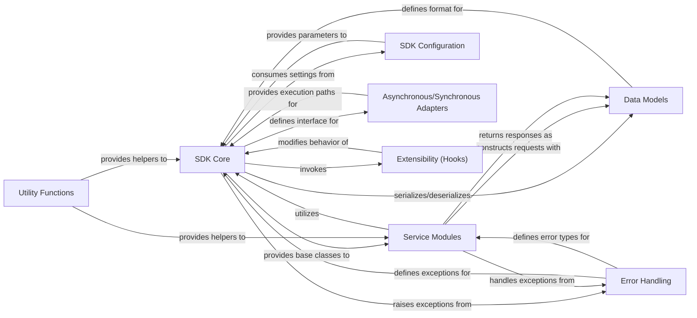

## Details

This section synthesizes the architectural components of the Friendli AI Python SDK, focusing on the `SDK Core` and its interactions within a client-side SDK pattern.

### SDK Core [[Expand]](./SDK_Core.md)
The foundational layer and central orchestrator of the SDK. It encapsulates the fundamental logic for API communication, request/response processing, and integrates core SDK abstractions. It provides the base classes (`BaseSDK`, `AsyncSDK`, `SyncSDK`) from which other service modules inherit, ensuring consistent interaction patterns and extensibility. It also manages global settings and extensibility points.

**Related Classes/Methods**:

- `friendli_core.basesdk`

### Service Modules [[Expand]](./Service_Modules.md)
These modules encapsulate specific API functionalities (e.g., Chat, Completions, Image, Dataset). They extend the `SDK Core`'s base classes to provide high-level, domain-specific methods for interacting with different parts of the Friendli AI platform.

**Related Classes/Methods**:

- `friendli_core.chat`
- `friendli_core.completions`

### Data Models
Defines the structured data objects (e.g., request bodies, response objects) used for communication with the Friendli AI platform. These models ensure type safety, consistency, and ease of use when exchanging data with the API.

**Related Classes/Methods**:

- `friendli_core.models`

### Error Handling [[Expand]](./Error_Handling.md)
Manages and standardizes error responses originating from the API or internal SDK operations. It provides custom exceptions and robust error handling mechanisms, allowing developers to gracefully manage and respond to issues.

**Related Classes/Methods**:

- `friendli_core.errors`

### SDK Configuration
Manages global settings and parameters for the SDK, such as API keys, base URLs, timeouts, and other configurable options. It provides a centralized mechanism for developers to customize the SDK's behavior.

**Related Classes/Methods**:

- `friendli_core.config`

### Utility Functions
Provides a collection of helper functions for common tasks that support the SDK's overall functionality. This includes operations like authentication, data serialization/deserialization, and other general-purpose utilities.

**Related Classes/Methods**:

- `friendli_core.utils`

### Asynchronous/Synchronous Adapters
Provides distinct interfaces and implementations for both asynchronous (non-blocking) and synchronous (blocking) API calls. This allows developers to choose the appropriate execution model based on their application's architecture and performance requirements.

**Related Classes/Methods**:

- `friendli_core.basesdk`

### Extensibility (Hooks)
Offers mechanisms for extending SDK behavior through hooks or context objects (e.g., `HookContext`). This allows developers to inject custom logic at various points in the request/response lifecycle without altering the core SDK code.

**Related Classes/Methods**:

- `friendli_core.basesdk`

### [FAQ](https://github.com/CodeBoarding/GeneratedOnBoardings/tree/main?tab=readme-ov-file#faq)
