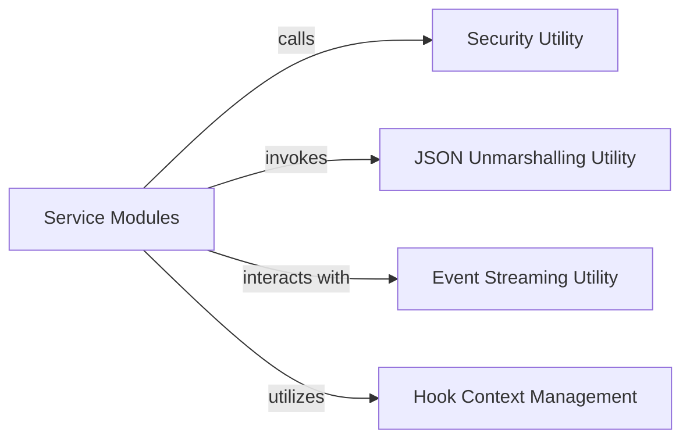

## Details

These components are chosen based on their fundamental architectural importance in a Client-side SDK. The `Service Modules` are the primary interface for users, encapsulating domain logic. The `Security Utility` is essential for authentication, a core cross-cutting concern. `JSON Unmarshalling Utility` and `Event Streaming Utility` are vital for handling diverse API response formats. Finally, `Hook Context Management` provides the necessary extensibility, aligning with the "Extensibility" principle mentioned in the project context. This set of components provides a clear, modular, and functional breakdown of the SDK's core responsibilities.

### Service Modules [[Expand]](./Service_Modules.md)
These modules encapsulate the core API domain logic for specific functionalities like Chat, Completions, Dataset management, and Image processing. They provide high-level, domain-specific methods that abstract the underlying API interactions, supporting both asynchronous and synchronous operations. This component is central to the SDK's usability, offering a clear interface for developers to interact with different parts of the Friendli API.

**Related Classes/Methods**:

- `friendli_core.chat.SyncChat`:18-372
- `friendli_core.chat.AsyncChat`:375-729
- `friendli_core.completions.SyncCompletions`:18-194
- `friendli_core.completions.AsyncCompletions`:197-373
- `friendli_core.dataset.SyncDataset`:19-1528
- `friendli_core.dataset.AsyncDataset`:1531-3040
- `friendli_core.image.SyncImage`:18-118
- `friendli_core.image.AsyncImage`:121-221

### Security Utility
Responsible for securely retrieving and managing API credentials, typically from environment variables or other configuration sources. This component ensures that API requests are properly authenticated.

**Related Classes/Methods**:

- `friendli_core.utils.security.get_security_from_env`:57-69

### JSON Unmarshalling Utility
Handles the deserialization of JSON responses received from the Friendli API into structured Python objects. This component is crucial for converting raw API data into usable formats within the SDK.

**Related Classes/Methods**:

- `friendli_core.utils.unmarshal_json_response.unmarshal_json_response`:11-24

### Event Streaming Utility
Provides mechanisms for processing and managing streaming responses from the API, particularly for operations that return continuous data streams (e.g., chat completions). It abstracts the complexities of handling server-sent events or similar streaming protocols.

**Related Classes/Methods**:

- `friendli_core.utils.eventstreaming.EventStream`:19-42
- `friendli_core.utils.eventstreaming.EventStreamAsync`:45-68

### Hook Context Management
Manages an extensibility mechanism that allows developers to inject custom logic (hooks) at various points during the API interaction lifecycle. This component supports the SDK's extensibility, enabling custom pre-processing, post-processing, or error handling.

**Related Classes/Methods**:

- `friendli_core._hooks.types.HookContext`:11-30

### [FAQ](https://github.com/CodeBoarding/GeneratedOnBoardings/tree/main?tab=readme-ov-file#faq)
