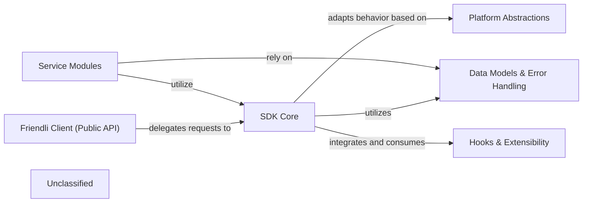

## Details

One paragraph explaining the functionality which is represented by this graph. What the main flow is and what is its purpose.

### Friendli Client (Public API) [[Expand]](./Friendli_Client_Public_API_.md)
The primary entry point for end-users, offering a high-level, consistent interface for interacting with the Friendli AI platform, supporting both synchronous and asynchronous operations.

**Related Classes/Methods**:

- `friendli_core.sdk`

### SDK Core [[Expand]](./SDK_Core.md)
The central orchestrator managing fundamental logic for API communication, request/response processing, and integrating foundational SDK abstractions and extensibility points.

**Related Classes/Methods**:

- `friendli_core.basesdk`

### Service Modules [[Expand]](./Service_Modules.md)
Encapsulate specific API domains (e.g., chat, completions, datasets), providing high-level, domain-specific methods that simplify interactions with particular parts of the Friendli API.

**Related Classes/Methods**:

- `friendli_core.chat`
- `friendli_core.completions`
- `friendli_core.dataset`
- `friendli_core.image`

### Data Models & Error Handling [[Expand]](./Data_Models_Error_Handling.md)
Defines standardized data structures for API requests and responses, along with a comprehensive set of error types, ensuring consistent data representation and robust error reporting.

**Related Classes/Methods**:

- `friendli_core.models`

### Platform Abstractions [[Expand]](./Platform_Abstractions.md)
Provides base structures and interfaces tailored for different operational modes or deployment types within the Friendli platform, enabling the SDK to adapt its behavior to the target environment.

**Related Classes/Methods**:

- `friendli_core.dedicated`
- `friendli_core.serverless`

### Hooks & Extensibility [[Expand]](./Hooks_Extensibility.md)
Offers an extensible mechanism for injecting custom logic at various stages of the request/response lifecycle, allowing for pre-processing, post-processing, and error handling customization.

**Related Classes/Methods**:

- `friendli_core._hooks`

### Unclassified
Component for all unclassified files and utility functions (Utility functions/External Libraries/Dependencies)

**Related Classes/Methods**: _None_

### Unclassified
Component for all unclassified files and utility functions (Utility functions/External Libraries/Dependencies)

**Related Classes/Methods**: _None_

### Unclassified
Component for all unclassified files and utility functions (Utility functions/External Libraries/Dependencies)

**Related Classes/Methods**: _None_

### Unclassified
Component for all unclassified files and utility functions (Utility functions/External Libraries/Dependencies)

**Related Classes/Methods**: _None_

### Unclassified
Component for all unclassified files and utility functions (Utility functions/External Libraries/Dependencies)

**Related Classes/Methods**: _None_

### Unclassified
Component for all unclassified files and utility functions (Utility functions/External Libraries/Dependencies)

**Related Classes/Methods**: _None_

### Unclassified
Component for all unclassified files and utility functions (Utility functions/External Libraries/Dependencies)

**Related Classes/Methods**: _None_

### Unclassified
Component for all unclassified files and utility functions (Utility functions/External Libraries/Dependencies)

**Related Classes/Methods**: _None_

### Unclassified
Component for all unclassified files and utility functions (Utility functions/External Libraries/Dependencies)

**Related Classes/Methods**: _None_

### Unclassified
Component for all unclassified files and utility functions (Utility functions/External Libraries/Dependencies)

**Related Classes/Methods**: _None_

### Unclassified
Component for all unclassified files and utility functions (Utility functions/External Libraries/Dependencies)

**Related Classes/Methods**: _None_

### [FAQ](https://github.com/CodeBoarding/GeneratedOnBoardings/tree/main?tab=readme-ov-file#faq)
