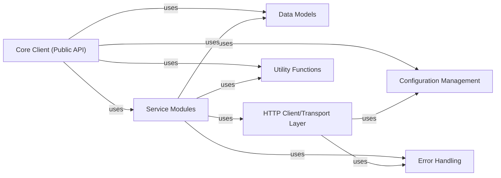

## Details

Final Component Overview for the `Friendli Client (Public API)` subsystem, structured according to Client-side SDK patterns.

### Core Client (Public API)
The primary entry point for end-users, offering a high-level, consistent interface for interacting with the Friendli AI platform, supporting both synchronous and asynchronous operations. It acts as the orchestrator, delegating requests to specific service modules.

**Related Classes/Methods**:

- `friendli_core.sdk`

### Service Modules [[Expand]](./Service_Modules.md)
Encapsulate the logic for interacting with specific API endpoints (e.g., chat, completions, images, audio). Each module handles the construction of requests, serialization of data models, and deserialization of responses for its domain.

**Related Classes/Methods**:

- `friendli_core.chat`
- `friendli_core.completions`
- `friendli_core.images` (1:1)
- `friendli_core.audio`

### Data Models
Define the structure of data exchanged with the Friendli AI platform, including request bodies, response objects, and various parameters. Ensures type safety and consistency across all API interactions within the SDK.

**Related Classes/Methods**:

- `friendli_core.models` (1:1)

### HTTP Client/Transport Layer
Handles the low-level HTTP communication with the Friendli AI platform. This includes managing connections, sending requests, receiving responses, and abstracting away network-level concerns like retries and timeouts.

**Related Classes/Methods**:

- `friendli_core.http_client` (1:1)

### Error Handling [[Expand]](./Error_Handling.md)
Manages and standardizes error responses from both the API and the network layer. It provides custom exception classes and mechanisms for users to gracefully handle API-related issues and network errors, ensuring a consistent error reporting experience.

**Related Classes/Methods**:

- `friendli_core.errors` (1:1)

### Configuration Management
Centralizes and manages SDK-wide configuration settings, such as API keys, base URLs, default timeouts, and retry policies. It provides a consistent and accessible way to configure the SDK's behavior.

**Related Classes/Methods**:

- `friendli_core.config` (1:1)

### Utility Functions
Provides common helper functions and reusable functionalities that support various parts of the SDK, such as authentication token management, data validation, or specific data transformations that are not tied to a particular API domain.

**Related Classes/Methods**:

- `friendli_core.utils` (1:1)

### [FAQ](https://github.com/CodeBoarding/GeneratedOnBoardings/tree/main?tab=readme-ov-file#faq)
